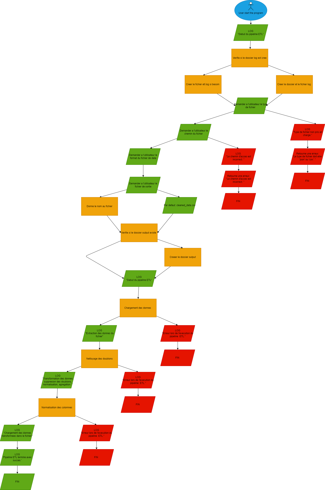

= Documentation de la Solution ETL
:author: Louis Van Elsuve
:date: 2024-12-18

== Introduction

Vous travaillez pour le groupe ANALYZE IT, spécialisé dans les données de santé et dépêché par l’OMS en tant que prestataire de service pour répondre à son besoin de création de Système d’Information. 

Votre équipe et vous-même avez la charge de développer une solution permettant d’ingérer des données provenant de différentes sources, telles que les bases de données publiques de santé, les archives hospitalières, les publications scientifiques, etc.  

Cette documentation décrit une solution ETL (Extraction, Transformation, Chargement) développée en Python pour traiter et normaliser des données issues de fichiers JSON et CSV. L'objectif principal est de fournir un pipeline automatisé et extensible qui garantit la qualité et l'accessibilité des donnée.

== Objectif

La solution vise à faciliter l’extraction de données provenant de différents formats (JSON, CSV) puis a standardiser et nettoyer les données pour une meilleure qualité.
- Centraliser les données transformées dans un fichier de sortie unique, organisé et prêt à l’emploi.
- Fournir une base flexible pour des traitements ETL futurs.

== Scope

Cette solution ETL couvre les aspects suivants :
- Lecture et extraction de fichiers JSON et CSV.
- Nettoyage des données : suppression des doublons et normalisation des noms de colonnes.
- Agrégation des données sur des colonnes spécifiques lorsque cela est pertinent.
- Enregistrement des données transformées dans un fichier CSV dans un répertoire de sortie (`output`).
- Journaux des opérations dans un fichier log.

Les cas d’utilisation futurs, comme l’ajout d'autres types de fichiers (XML, bases de données), ne sont pas inclus dans ce document.

== Workflow

Le pipeline ETL suit les étapes suivantes :

**Extraction**

- Lecture des fichiers JSON ou CSV en entrée.
- Chargement des données dans un DataFrame pour manipulation.

**Transformation**

- Nettoyage des doublons.
- Normalisation des noms de colonnes (conversion en minuscules, suppression des espaces).
- Agrégation conditionnelle sur des colonnes numériques comme `value`.

**Chargement**

- Enregistrement des données transformées dans un fichier CSV dans le dossier `output`.

**Logging**

- Documentation des étapes et erreurs dans le fichier `etl.log`.

== Stakeholders

Les parties prenantes principales incluent :

L’OMS : organisation cliente qui utilisera les données transformées pour des analyses et des décisions stratégiques.

Équipes analytiques : équipes de DATA ANALYZE IT, responsables de traiter les données pour répondre aux besoins spécifiques de l’OMS.

Développeurs techniques : responsables du maintien et de l’évolution de la solution ETL.

== Prérequis

- Connaissances de base en Python.
- Familiarité avec les formats de fichiers JSON et CSV.

== Dépendances

- Python 3.7 ou version ultérieure.

- Bibliothèques Python :

  - `pandas`
  - `json`
  - `argparse`
  - `os`
  - `logging`

== Functional Requirements

**Extraction des données** 

La solution doit pouvoir lire les fichiers JSON et CSV fournis.

Elle doit gérer les chemins d'entrée fournis par l'utilisateur.

**Transformation des données**

Suppression des doublons.

Normalisation des noms de colonnes.

Agrégation des valeurs par catégorie lorsque cela est applicable.

**Chargement des données**

Les données transformées doivent être sauvegardées dans un fichier CSV dans le dossier `output`.

**Logs**

Les opérations (succès et erreurs) doivent être consignées dans `log/etl.log`.

== Non-Functional Requirements

**Performance**

Le pipeline doit pouvoir traiter des fichiers contenant jusqu'à 1 million de lignes sans erreur.

**Extensibilité** 

La solution doit permettre l'ajout futur de nouveaux formats de fichiers ou transformations.

**Fiabilité**

Les erreurs doivent être gérées de manière robuste, avec des messages clairs dans les journaux.

**Accessibilité des logs**

Les journaux doivent être lisibles et compréhensibles pour les utilisateurs techniques.

**Structure des fichiers** 

Les répertoires nécessaires (`output`, `log`) doivent être créés automatiquement si absents.

== Conclusion

Cette solution ETL permet donc la gestion de données au format JSON et CSV. Avec des fonctionnalités de transformation et un système de journalisation fiable, elle répond aux besoins des équipes techniques et analytiques tout en restant extensible pour des améliorations futures.

